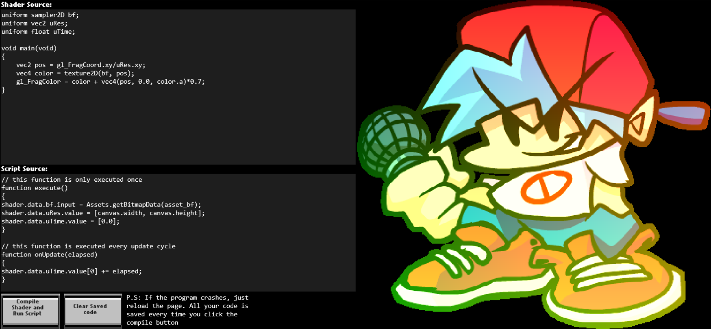

## Shader Playground
A place to play with and experiment with GLSL shaders. Also you can use haxe code to manipulate the shader uniforms and such. Available on the web: [Click here](https://uncertainprod.github.io/shaderplayground/index.html)

### Here's one example I made:
Shiny bf lol:

This is a small hobby project I had decided to take up, and it's probably not going to be maintained or improved upon much (maybe just a little probably :) ). However, feel free to fork this project and improve upon it however you want (just credit this repo if you do).

Made in Haxe using [Haxeflixel](https://haxeflixel.com/) and [OpenFL](https://www.openfl.org/)